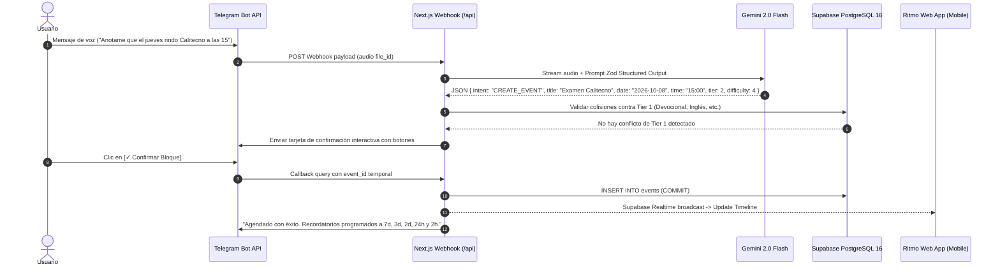

# AI_TECHLEAD_BRIEF.md — Briefing Estratégico & Técnico para el AI Tech Lead

> **Producto:** Ritmo — Calendario & Anotador Personal Inteligente  
> **Estado:** Fase de Arquitectura & Construcción de Producción  
> **Responsable:** AI Tech Lead  
> **Zona Horaria del Usuario:** `America/Argentina/Buenos_Aires` (UTC-3)  
> **Presupuesto Máximo de Operación:** $0.00 USD / mes (Hobby Free Tiers)

---

## 1. Declaración de Misión: Por Qué Ritmo y Por Qué Falla Google Calendar

Los calendarios tradicionales como **Google Calendar**, **Outlook** o **Apple Calendar** se diseñaron hace 20 años bajo un modelo puramente **pasivo y reactivo**:
1. **Pasividad Crónica:** Si un usuario no asiste a un bloque o una tarea se desborda, Google Calendar permanece en silencio. Las tareas no completadas quedan en el pasado como fósiles de culpa.
2. **Falta de Opinión / Neutralidad Tóxica:** Trata con el mismo peso cognitivo una entrega final de examen en la UTN que un recordatorio menor. No comprende la jerarquía de vida del usuario ni protege sus compromisos sagrados.
3. **Fricción Extrema de Reordenamiento:** Mover 6 bloques tras un imprevisto exige decenas de clics, arrastres manuales y cálculos mentales de colisiones.
4. **Desconexión del Flujo Académico y Móvil:** No se integra nativamente con las tareas vivas de Google Classroom ni permite que el usuario hable por audio en Telegram mientras viaja en colectivo para agendar un bloque estructurado.

**Ritmo** resuelve esto transformándose en un **sistema operativo personal activo, opinado y asistido por Inteligencia Artificial**. Ritmo sabe cuándo el usuario tiene devocional, cuándo cursa inglés o cuándo debe entregar 3 láminas de dibujo técnico. Protege lo sagrado, gestiona la carga y propone soluciones táctiles e inteligentes ante desbordes.

```
       [ENTORNO DEL USUARIO]
      Audio / Texto en Telegram
      Fotos de Pizarrón / Cuadernos
      Google Classroom Deadlines
                  │
                  ▼
   ┌──────────────────────────────┐
   │    GOOGLE GEMINI 2.0 FLASH   │  (Extracción Zod, 15 RPM Free Tier,
   │  Clasificación & Detección   │   OCR Multimodal, Difficulty Scoring)
   └──────────────┬───────────────┘
                  │
                  ▼
   ┌──────────────────────────────┐
   │    CORE RITMO (Next.js 14)   │  (Tier Validation, Smart Quiet Windows,
   │   Supabase PostgreSQL 16     │   Human-in-the-Loop Rescheduler)
   └──────────────┬───────────────┘
                  │
        ┌─────────┴─────────┐
        ▼                   ▼
┌───────────────┐   ┌───────────────┐
│ NEXT.JS PWA   │   │ TELEGRAM BOT  │
│ Vista Táctil  │   │ Alertas 7d-2h │
│ Drag & Drop   │   │ Confirmaciones│
└───────────────┘   └───────────────┘
```

---

## 2. Pila Tecnológica & Gobernanza de Costo Cero ($0.00 USD/mes)

Para garantizar viabilidad perpetua sin costos fijos, el sistema se acopla a las siguientes capas de infraestructura gratuita:

| Capa | Proveedor / Tecnología | Restricción / Límite Free Tier | Mitigación y Buenas Prácticas |
| :--- | :--- | :--- | :--- |
| **Frontend / Backend** | **Next.js 14+ en Vercel Hobby** | 100 Serverless Execution Hours / mes. Max 10s por función. | Optimistic UI en cliente; tareas asíncronas vía webhooks; endpoints serverless ultra livianos. |
| **Base de Datos** | **Supabase (PostgreSQL 16)** | 500 MB almacenamiento; pausa tras 7 días de inactividad. | Pings diarios programados vía cron; schema normalizado; purga de logs temporales. |
| **Motor de IA** | **Google Gemini 2.0 Flash (AI Studio)** | 15 Requests Per Minute (RPM); 1,500 RPD en Free Tier. | Cola con semáforo de concurrencia; structured output con Zod; fallback de reintentos exponenciales. |
| **Mensajería** | **Telegram Bot API** | Gratis (límite de 30 mensajes/segundo hacia usuarios). | Webhook HTTPS conectado a Vercel; respuestas diferidas mediante inline keyboards. |
| **Integración Escolar** | **Google Classroom API & Drive** | Google Cloud Free Quotas (100k queries/día). | Sincronización diferencial (delta sync) periódica; solo consulta cursos activos. |

---

## 3. Modelo Semántico de Rutina: La Jerarquía Sagrada de Tres Niveles (Tiers)

Ritmo estructura cada minuto del día bajo una jerarquía inviolable. Las colisiones se resuelven por precedencia estricta:

### 3.1. Tier 1: Inamovibles Sagrados (Prioridad Inviolable)
Bloques blindados contra cualquier reprogramación automática:
1. **Devocional Diario con Dios:** Oración y lectura bíblica matutina/nocturna (no negociable).
2. **Instituto de Inglés:** Martes y Jueves, 18:30 a 20:30.
3. **UTN Ingreso:** Sábados 08:00 a 14:30 (hasta inicios de noviembre).
   - *Hito Crítico:* Parcial 2 el **24 de Octubre**.
   - *Hito Crítico:* Recuperatorio el **7 de Noviembre**.
4. **Iglesia & Comunidad:**
   - Miércoles: 19:00 a 21:30 (Célula / Reunión de mitad de semana).
   - Sábados: 17:00 a 23:00 (Jóvenes / Servicio).
   - Domingos: 18:00 a 23:00 (Reunión general de alabanza).
5. **Torneo de Fútbol:** Domingos de 08:00 a 14:00.

### 3.2. Tier 2: Movibles Estructurados (Restricciones Suaves)
Bloques que deben cumplirse pero cuyos intervalos pueden desplazarse dentro del día o semana:
- **Pasantías Virtuales:** Carga flexible semanal, ajustable según necesidad académica.
- **Salida Escolar / Secundaria:**
  - Lunes: Salida a las 18:00.
  - Miércoles: Salida a las 13:00 o 17:00 (según rotación).
  - Viernes: Salida a las 13:20 o 16:10 (según contraturno de taller).

### 3.3. Tier 3: Hábitos y Carga Cognitiva (Totalmente Reprogramables)
Bloques elásticos que Ritmo distribuye en los huecos disponibles:
- **Dibujo Técnico:** 3 láminas semanales (~2 horas de trabajo por lámina = 6 horas totales/semana).
- **Estudio Anticipado para Exámenes:**
  - Exámenes regulares: 1 a 2 días de estudio previo intensivo.
  - UTN Parciales: 2 semanas de preparación estructurada con simulación de parciales.
- **Práctica Diaria de Guitarra e Inglés:** 1 hora al día.
- **Proyectos de Inteligencia Artificial & Programación:** 2 a 3 horas diarias.
- **Nuevas Habilidades (Skills):** 1 a 2 horas diarias.
- **Entrenamiento de Gimnasio con Pesas:** 1 a 2 horas diarias.

---

## 4. Algoritmos Clave del Núcleo de Ritmo

### 4.1. Cadencia de Alertas & Ventanas de Silencio Inteligentes (Smart Quiet Windows)
Las alertas no se disparan indiscriminadamente. Siguen una cadencia preventiva estricta:
- **7 días antes:** Notificación de radar a largo plazo (planificación semanal).
- **3 días antes:** Notificación de preparación de insumos/materiales.
- **2 días antes:** Alerta de aceleración de sprint (bloque de foco recomendado).
- **24 horas antes:** Notificación de cierre y verificación de requisitos.
- **2 horas antes:** Alerta táctica inminente de entrega o examen.

#### Regla de Smart Quiet Windows (Silencio Sagrado):
Si una alerta coincide temporalmente con un bloque de **Tier 1** (Devocional, Iglesia, UTN, Inglés), el despachador de alertas suprime el sonido y retiene el mensaje en cola. El mensaje se despacha automáticamente en la **Ventana de Transición** (los 15-30 minutos posteriores a la finalización del bloque inamovible).

### 4.2. Motor de Reprogramación Human-in-the-Loop (HITL)
Cuando un evento se extiende o surge un imprevisto que genera un **Overbooking** (>24 horas o colisión con Tier 1/2), el motor opera así:
1. **Detección de Desborde:** El motor calcula la suma de duraciones y detecta solapamientos.
2. **Generación de 3 Escenarios:**
   - *Escenario A (Compensación Diaria):* Reduce bloques elásticos de Tier 3 (ej. 45 min de guitarra y gimnasio breve) para mantener las láminas de dibujo al día.
   - *Escenario B (Desplazamiento al Fin de Semana):* Mueve 1 lámina al bloque de buffer del domingo por la tarde (post torneo de fútbol).
   - *Escenario C (Priorización Extrema de UTN):* Pausa temporalmente proyectos de IA y redistribuye toda la carga a matemática y dibujo.
3. **Despacho a Telegram:** Se envía una tarjeta interactiva con botones:
   `[Aplicar Escenario A]` `[Aplicar Escenario B]` `[Aplicar Escenario C]` `[Rechazar / Ajustar Manual]`.
4. **Mutación Segura:** Solo tras el clic del usuario, la base de datos ejecuta una transacción atómica actualizando las fechas y horas de los bloques.

---

## 5. Arquitectura del Anotador Híbrido & Pipeline con NotebookLM

El sistema de notas de Ritmo no es un bloc de texto plano; se divide en dos componentes:
1. **Notas Contextuales del Día:** Vinculadas directamente al registro de fecha o a un bloque horario específico (ej. "Dudas de trigonometría surgidas en la clase del sábado de UTN").
2. **Backlog Global de Ideas & Tareas:** Repositorio etiquetado por categorías (`#utn`, `#dibujo`, `#devocional`, `#proyectos`, `#ideas`).

### Sincronización con Google Drive & Google NotebookLM:
- Toda nota o resumen clasificado como `#utn` o `#estudio` se serializa en Markdown estructurado y se sincroniza automáticamente mediante la Google Drive API en la carpeta dedicada `/Ritmo_UTN_Notes/`.
- Esta carpeta actúa como fuente viva (**Source Directory**) para Google NotebookLM, permitiendo al usuario generar guías de estudio, resúmenes en audio y preguntas de autoevaluación directamente antes de los parciales de UTN.

---

## 6. Diagrama de Flujo del Sistema General



---

## 7. Responsabilidades del AI Tech Lead

1. **Garantizar Type Safety Absoluto:** Cada interfaz debe tiparse en TypeScript y validarse con Zod.
2. **Proteger la Experiencia Móvil:** La vista principal de calendario debe sentirse tan nativa como Google Calendar Mobile, con soporte fluido de arrastre táctil para reordenar bloques.
3. **Auditar la Cuota en cada PR:** Prohibir llamadas redundantes a Gemini 2.0 Flash. Cachear respuestas idénticas y exigir confirmaciones antes de gastar invocaciones de IA.
