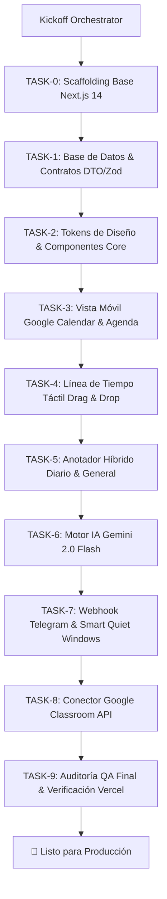

# 🤖 ORCHESTRATION.md — Protocolo Maestro de Orquestación Multi-Agente (Ritmo)

> **Destinatario Principal:** Gentle AI Orchestrator (Antigravity), Tech Lead y Agentes Autónomos.  
> **Propósito:** Protocolo supremo para la construcción y despliegue autónomo de **Ritmo** sin fricción ni interrupciones del usuario humano.  
> **Metodología:** VetConnect AI-First Engineering / Clean Architecture / TDD Quirófano.  
> **Estado:** 🟢 APROBADO PARA EJECUCIÓN AUTÓNOMA

---

## 🗺️ 1. Matriz de Agentes Especializados (Roles & Dominio)

El orquestador coordina la construcción de Ritmo delegando el trabajo en agentes especializados de runtime con misiones acotadas y contratos estrictos:

| Agente | Responsabilidad Principal | Entregables / Verificación |
|---|---|---|
| **Orchestrator (Tech Lead)** | Supervisión global, síntesis, transición de fases y verificación DoD. | Aprobación de fases y pipelines limpios |
| **Scaffolding Agent** | Estructura Next.js 14 App Router, TypeScript estricto, Tailwind CSS y PWA. | `npm run build` sin errores |
| **Database & Schema Agent** | DDL Supabase PostgreSQL 16, migraciones, RLS, triggers y RPCs. | Validación de schemas y tipos generados |
| **Design System & UI Agent** | Tokens de color (`--purple`, `--red`, etc.), tipografías y componentes atómicos. | Componentes conformes con tokens congelados |
| **Mobile Calendar Agent** | Vista Google Calendar Mobile (mes colapsable a tira semanal + feed agenda + FAB). | Navegación fluida y mobile-first 375-430px |
| **Tactile Timeline Agent** | Línea de tiempo táctil con drag-and-drop, long-press y protección Tier 1. | Arrastre y reordenamiento con estados optimistas |
| **Hybrid Notes Agent** | Módulo de notas contextuales diarias y banco de ideas/backlog general. | CRUD completo con timestamps |
| **AI Engine Agent** | Integración Gemini 2.0 Flash con esquemas Zod estructurados. | Parsing de intenciones y scoring de tareas |
| **Telegram Bot Agent** | Webhooks en Next.js, tarjetas interactivas de confirmación y Smart Quiet Windows. | Procesamiento de voz/texto y despacho de alertas |
| **Classroom Sync Agent** | Cliente OAuth2 de Google Classroom API y delta polling de tareas. | Ingestión de consignas sin duplicados |
| **QA & Verification Agent** | Tests unitarios, de integración y compilación estricta de TypeScript. | `tsc --noEmit` y suite de tests en verde |

---

## 🔄 2. Flujo Autónomo de Ejecución (The Gentle AI Loop)

### Reglas de Autonomía Incondicional:
1. **Zero Human Micro-prompts:** El orquestador ejecuta los Task Packets de forma continua. El usuario solo supervisa el avance en la consola o reportes de estado.
2. **Single Source of Truth:** Ningún agente inventa campos ni endpoints; se respeta `docs/TECH_REFERENCE.md` y `docs/SPEC.md`.
3. **Rollback Preventivo:** Si un subagente genera código que no compila con `tsc --noEmit`, el orquestador revierte o invoca a un debugger agent de inmediato.
