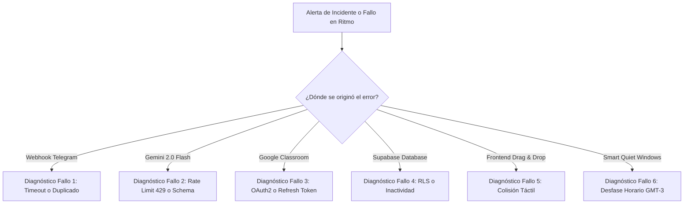

# PROTOCOLO_DEBUGGING.md — Manual de Triaje, Diagnóstico e Incidentes

> **Proyecto:** Ritmo — Calendario & Anotador Personal Inteligente  
> **Estándar de Errores:** RFC 7807 (Problem Details for HTTP APIs)  
> **Propósito:** Procedimientos sistemáticos para aislar, depurar y resolver fallos en producción y desarrollo local sin degradar la experiencia de usuario.

---

## 1. Estándar de Errores RFC 7807 en Ritmo

Todo fallo interceptado en el backend de Ritmo (Next.js App Router, webhooks de Telegram, integraciones con Gemini o Supabase) debe retornar un cuerpo estructurado bajo el estándar **RFC 7807**:

### 1.1. Contrato JSON Oficial
```json
{
  "type": "https://ritmo.local/errors/gemini-rate-limit",
  "title": "Límite de solicitudes de IA excedido",
  "status": 429,
  "detail": "Se superó la cuota de 15 peticiones por minuto en Gemini 2.0 Flash. Reintentando con retroceso exponencial.",
  "instance": "/api/telegram/webhook#msg-98124",
  "code": "ERR_GEMINI_429_RPM",
  "timestamp": "2026-10-04T18:15:22.104Z",
  "invalidParams": []
}
```

### 1.2. Mapeo de Códigos Internos de Error
| Código Interno | HTTP Status | Módulo | Descripción / Causa Raíz |
| :--- | :---: | :--- | :--- |
| `ERR_AUTH_UNAUTHORIZED` | 401 | Seguridad | `RITMO_MASTER_TOKEN` inválido o ausente en el header. |
| `ERR_TIER1_CONFLICT` | 409 | Calendario | Intento de solapamiento o reprogramación de un bloque sagrado (Dios, UTN, Iglesia, Inglés). |
| `ERR_GEMINI_429_RPM` | 429 | Motor IA | Límite de 15 RPM alcanzado en Google AI Studio. |
| `ERR_GEMINI_SCHEMA_MISMATCH`| 502 | Motor IA | La respuesta del LLM no validó contra el esquema Zod requerido. |
| `ERR_TELEGRAM_TIMEOUT` | 504 | Bot | La invocación del webhook tardó más de 5 segundos; Telegram reenvió el mensaje. |
| `ERR_CLASSROOM_TOKEN_EXPIRED`| 401 | Classroom | Refresh token de Google OAuth2 revocado o vencido. |
| `ERR_TIMELINE_COLLISION` | 422 | Frontend | Solapamiento en drag-and-drop con un bloque no deformable. |

---

## 2. Los 6 Modos de Fallo Críticos y Procedimientos de Resolución



---

### Fallo 1: Timeouts y Mensajes Duplicados en el Webhook de Telegram
- **Síntoma:** El bot de Telegram procesa un audio dos veces, creando dos tarjetas de confirmación idénticas.
- **Causa Raíz:** Telegram exige respuesta HTTP 200 en menos de 5 segundos. La transcripción y extracción con Gemini puede tardar entre 4 y 7 segundos en audios largos, provocando que Telegram reintente el envío.
- **Protocolo de Mitigación:**
  1. El endpoint `/api/telegram/webhook` debe registrar el `message_id` en una tabla o set de deduplicación en memoria/Supabase (`telegram_processed_messages`).
  2. Si el `message_id` ya existe, retornar HTTP 200 inmediatamente sin invocar a Gemini.
  3. Despachar la llamada pesada a Gemini en un worker asíncrono o función edge desacoplada, respondiendo de inmediato con un mensaje provisional: *"Transcribiendo y analizando tu audio..."*.

---

### Fallo 2: Rate Limit (429) o Discrepancia de Esquema en Gemini 2.0 Flash
- **Síntoma:** El bot o la web devuelven un error `ERR_GEMINI_429_RPM` o una falla en `.safeParse()` de Zod.
- **Causa Raíz:** Más de 15 peticiones en un minuto, o el modelo alucinó claves inesperadas en el JSON estructurado.
- **Protocolo de Mitigación:**
  1. Implementar **Exponential Backoff con Jitter**: reintentar a los 2s, 4s y 8s.
  2. Si persiste el error 429 tras 3 intentos, degradar el servicio: guardar el texto en bruto en `notes` con etiqueta `#sin-procesar` y notificar al usuario: *"Guardé tu nota sin procesar por alta demanda de IA. Podés categorizarla manualmente"*.
  3. Para fallos de esquema, usar validaciones flexibles con `.catch()` o valores predeterminados seguros en Zod (ej. `duration: z.number().default(60)`).

---

### Fallo 3: Expiración de Tokens OAuth2 de Google Classroom & Drive
- **Síntoma:** Las tareas de Classroom no se actualizan y el log muestra `invalid_grant` de Google API.
- **Causa Raíz:** El token de acceso expiró (dura 1 hora) y la llamada de refresco falló, o el `refresh_token` fue revocado tras 6 meses de inactividad de la app en modo de prueba en Google Cloud Console.
- **Protocolo de Mitigación:**
  1. Verificar que el cliente de Google en Next.js use la estrategia de refresco automático:
     ```typescript
     oauth2Client.on('tokens', (tokens) => {
       if (tokens.refresh_token) {
         saveRefreshTokenToSupabase(tokens.refresh_token);
       }
     });
     ```
  2. Si el refresco devuelve `invalid_grant`, el bot de Telegram debe enviar un enlace seguro para reautenticación rápida con un solo toque: `https://ritmo.local/api/auth/google/login`.

---

### Fallo 4: Supabase RLS o Rechazo de Master Token
- **Síntoma:** Las peticiones desde el frontend o bot fallan con `401 Unauthorized` o `403 Forbidden`.
- **Causa Raíz:** Discrepancia en el header `x-ritmo-token` o la base de datos Supabase entró en suspensión tras 7 días sin tráfico (política del Free Tier).
- **Protocolo de Mitigación:**
  1. **Evitar suspensión (Keep-Alive):** Configurar un cron job en GitHub Actions o Vercel Cron que ejecute un `SELECT 1` cada 24 horas.
  2. **Validación de Token:** Verificar que `.env.local` y las variables de producción en Vercel compartan idéntico `RITMO_MASTER_TOKEN`.

---

### Fallo 5: Colisiones en el Drag-and-Drop Táctil de la Línea de Tiempo
- **Síntoma:** El usuario arrastra un bloque de dibujo sobre las 19:00 del miércoles (horario de célula en la iglesia), produciendo un salto visual caótico.
- **Causa Raíz:** La UI permitió soltar el elemento en una franja prohibida de Tier 1 sin validación de colisión previa en el puntero táctil.
- **Protocolo de Mitigación:**
  1. **Zonas Magnéticas Prohibidas:** Durante el arrastre (`dragOver`), marcar los bloques de Tier 1 con un contorno rojo translúcido y deshabilitar el drop target.
  2. **Rollback Animado:** Si el evento `drop` se emite dentro de una zona prohibida, disparar la animación de retorno a la posición original en 200ms y emitir vibración de rechazo:
     ```typescript
     if (isCollidingWithTier1(dropTimestamp)) {
       triggerHapticError();
       animateBlockToOriginalPosition();
       showToast("No podés mover bloques sobre tus horarios de Iglesia o UTN.");
       return;
     }
     ```

---

### Fallo 6: Desfases Horarios en Smart Quiet Windows (GMT-3 vs UTC)
- **Síntoma:** Ritmo despacha una alerta ruidosa a las 19:30 en medio de la clase de inglés de los martes.
- **Causa Raíz:** El servidor serverless en Vercel opera en UTC (GMT+0), evaluando la hora actual como 22:30 en lugar de 19:30 GMT-3.
- **Protocolo de Mitigación:**
  1. **Nunca usar `new Date().getHours()` sin conversión:** Siempre formatear y comparar fechas utilizando `date-fns-tz` forzando la zona `America/Argentina/Buenos_Aires`:
     ```typescript
     import { toZonedTime } from 'date-fns-tz';
     const userTime = toZonedTime(new Date(), 'America/Argentina/Buenos_Aires');
     ```
  2. Todas las columnas temporales en Supabase deben ser `TIMESTAMPTZ` (timestamp with time zone).

---

## 3. Estándar de Telemetría y Logging Estructurado

Está prohibido usar `console.log()` en crudo. Todo log de servidor debe ser emitido en formato JSON estructurado con un `correlationId` para trazabilidad punta a punta:

```typescript
export function logSystemEvent(level: 'INFO' | 'WARN' | 'ERROR', message: string, meta: Record<string, any>) {
  console.log(JSON.stringify({
    timestamp: new Date().toISOString(),
    level,
    message,
    correlationId: meta.correlationId || crypto.randomUUID(),
    module: meta.module || 'SYSTEM',
    ...meta
  }));
}
```
