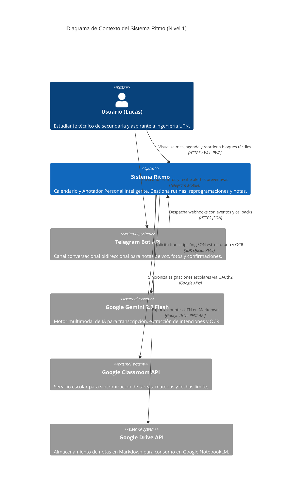
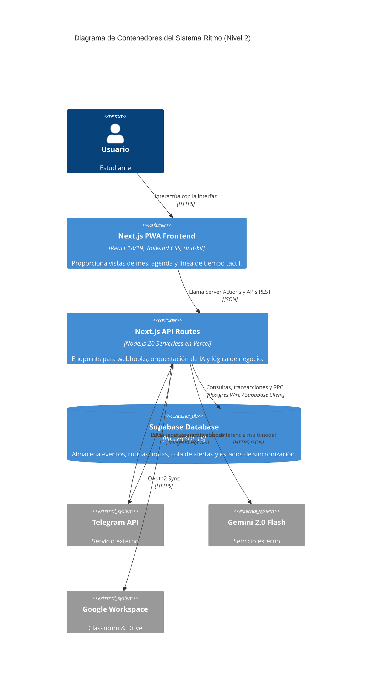

# ARCHITECTURE.md — Arquitectura Global del Sistema & Esquema de Base de Datos

> **Proyecto:** Ritmo — Calendario & Anotador Personal Inteligente  
> **Versión:** 1.0.0-PROD  
> **Patrón:** Clean Architecture / Microservicios Ligeros en Serverless  
> **Base de Datos:** Supabase PostgreSQL 16 (Modo Monousuario Soberano)

---

## 1. Modelo C4: Diagramas de Arquitectura

### 1.1. Nivel 1: Diagrama de Contexto del Sistema


---

### 1.2. Nivel 2: Diagrama de Contenedores


---

## 2. Esquema DDL Completo de Base de Datos (PostgreSQL 16 en Supabase)

El siguiente script SQL define la infraestructura relacional de persistencia de Ritmo. Contiene enums, tablas con claves foráneas, restricciones de integridad, índices de alto rendimiento y políticas de seguridad (RLS):

```sql
-- ============================================================================
-- RITMO — ESQUEMA MAESTRO DE PRODUCCIÓN (SUPABASE POSTGRESQL 16)
-- ============================================================================

-- Habilitar extensiones necesarias
CREATE EXTENSION IF NOT EXISTS "uuid-ossp";
CREATE EXTENSION IF NOT EXISTS "pgcrypto";

-- 1. TIPOS ENUMERADOS (DOMINIOS SEMÁNTICOS)
CREATE TYPE event_tier AS ENUM ('tier_1', 'tier_2', 'tier_3');
CREATE TYPE event_color AS ENUM ('red', 'orange', 'blue', 'green', 'yellow', 'purple');
CREATE TYPE task_status AS ENUM ('pending', 'in_progress', 'completed', 'rescheduled', 'cancelled');
CREATE TYPE alert_cadence AS ENUM ('7_days', '3_days', '2_days', '24_hours', '2_hours');
CREATE TYPE alert_status AS ENUM ('scheduled', 'quiet_suppressed', 'dispatched', 'failed');

-- 2. TABLA DE PERFIL DE USUARIO SOBERANO (MONOUSUARIO)
CREATE TABLE users_profile (
    id UUID PRIMARY KEY DEFAULT gen_random_uuid(),
    username TEXT NOT NULL UNIQUE DEFAULT 'lucas_ritmo',
    full_name TEXT NOT NULL DEFAULT 'Lucas',
    timezone TEXT NOT NULL DEFAULT 'America/Argentina/Buenos_Aires',
    telegram_chat_id BIGINT UNIQUE,
    google_refresh_token TEXT,
    google_token_expiry TIMESTAMPTZ,
    created_at TIMESTAMPTZ NOT NULL DEFAULT timezone('utc'::text, now()),
    updated_at TIMESTAMPTZ NOT NULL DEFAULT timezone('utc'::text, now())
);

-- 3. TABLA DE EVENTOS Y BLOQUES DE CALENDARIO
CREATE TABLE events (
    id UUID PRIMARY KEY DEFAULT gen_random_uuid(),
    title TEXT NOT NULL,
    description TEXT,
    event_date DATE NOT NULL,
    start_time TIME NOT NULL,
    end_time TIME NOT NULL,
    tier event_tier NOT NULL DEFAULT 'tier_3',
    color event_color NOT NULL DEFAULT 'orange',
    is_inamovible BOOLEAN GENERATED ALWAYS AS (tier = 'tier_1') STORED,
    difficulty_score SMALLINT CHECK (difficulty_score BETWEEN 1 AND 5),
    classroom_coursework_id TEXT UNIQUE,
    created_from TEXT DEFAULT 'web' CHECK (created_from IN ('web', 'telegram_voice', 'telegram_ocr', 'classroom_sync', 'template')),
    created_at TIMESTAMPTZ NOT NULL DEFAULT timezone('utc'::text, now()),
    updated_at TIMESTAMPTZ NOT NULL DEFAULT timezone('utc'::text, now()),
    CONSTRAINT chk_time_order CHECK (end_time > start_time)
);

-- Índices de alto rendimiento para búsqueda y renderizado de calendario
CREATE INDEX idx_events_date ON events(event_date);
CREATE INDEX idx_events_tier ON events(tier);
CREATE INDEX idx_events_date_start ON events(event_date, start_time);

-- 4. TABLA DE PLANTILLAS DE RUTINA FIJA (TIER 1 Y RECURRENTES)
CREATE TABLE routine_templates (
    id UUID PRIMARY KEY DEFAULT gen_random_uuid(),
    title TEXT NOT NULL,
    day_of_week SMALLINT NOT NULL CHECK (day_of_week BETWEEN 0 AND 6), -- 0=Domingo, 6=Sábado
    start_time TIME NOT NULL,
    end_time TIME NOT NULL,
    tier event_tier NOT NULL DEFAULT 'tier_1',
    color event_color NOT NULL,
    description TEXT,
    is_active BOOLEAN NOT NULL DEFAULT true,
    CONSTRAINT chk_template_time_order CHECK (end_time > start_time)
);

-- 5. TABLA DE SINCRONIZACIÓN CON GOOGLE CLASSROOM
CREATE TABLE classroom_sync (
    id UUID PRIMARY KEY DEFAULT gen_random_uuid(),
    course_id TEXT NOT NULL,
    course_name TEXT NOT NULL,
    coursework_id TEXT NOT NULL UNIQUE,
    title TEXT NOT NULL,
    description TEXT,
    due_date TIMESTAMPTZ,
    alternate_link TEXT,
    state TEXT NOT NULL,
    last_synced_at TIMESTAMPTZ NOT NULL DEFAULT timezone('utc'::text, now())
);

CREATE INDEX idx_classroom_coursework ON classroom_sync(coursework_id);

-- 6. TABLA DEL ANOTADOR HÍBRIDO (NOTAS DIARIAS Y BACKLOG)
CREATE TABLE notes (
    id UUID PRIMARY KEY DEFAULT gen_random_uuid(),
    title TEXT NOT NULL,
    content_markdown TEXT NOT NULL,
    category_tag TEXT NOT NULL DEFAULT '#general', -- #utn, #dibujo, #devocional, #proyectos
    linked_date DATE,                             -- Si es null, pertenece al backlog general
    linked_event_id UUID REFERENCES events(id) ON DELETE SET NULL,
    synced_to_drive BOOLEAN NOT NULL DEFAULT false,
    drive_file_id TEXT,
    created_at TIMESTAMPTZ NOT NULL DEFAULT timezone('utc'::text, now()),
    updated_at TIMESTAMPTZ NOT NULL DEFAULT timezone('utc'::text, now())
);

CREATE INDEX idx_notes_tag ON notes(category_tag);
CREATE INDEX idx_notes_linked_date ON notes(linked_date);

-- 7. TABLA DE COLA DE ALERTAS Y SMART QUIET WINDOWS
CREATE TABLE alerts_queue (
    id UUID PRIMARY KEY DEFAULT gen_random_uuid(),
    event_id UUID NOT NULL REFERENCES events(id) ON DELETE CASCADE,
    cadence alert_cadence NOT NULL,
    scheduled_for TIMESTAMPTZ NOT NULL,
    status alert_status NOT NULL DEFAULT 'scheduled',
    suppressed_until TIMESTAMPTZ,
    dispatched_at TIMESTAMPTZ,
    error_message TEXT,
    created_at TIMESTAMPTZ NOT NULL DEFAULT timezone('utc'::text, now())
);

CREATE INDEX idx_alerts_pending ON alerts_queue(status, scheduled_for) WHERE status = 'scheduled';

-- 8. TABLA DE PROPUESTAS DE REPROGRAMACIÓN (HUMAN-IN-THE-LOOP)
CREATE TABLE reschedule_proposals (
    id UUID PRIMARY KEY DEFAULT gen_random_uuid(),
    source_event_id UUID REFERENCES events(id) ON DELETE CASCADE,
    detected_overflow_reason TEXT NOT NULL,
    scenarios_json JSONB NOT NULL, -- Array con Escenario A, B, C
    selected_scenario TEXT,        -- 'A', 'B', 'C' o null
    status TEXT NOT NULL DEFAULT 'pending' CHECK (status IN ('pending', 'applied', 'rejected')),
    created_at TIMESTAMPTZ NOT NULL DEFAULT timezone('utc'::text, now()),
    resolved_at TIMESTAMPTZ
);

-- ============================================================================
-- 9. SEGURIDAD Y POLÍTICAS ROW LEVEL SECURITY (RLS)
-- ============================================================================

ALTER TABLE users_profile ENABLE ROW LEVEL SECURITY;
ALTER TABLE events ENABLE ROW LEVEL SECURITY;
ALTER TABLE routine_templates ENABLE ROW LEVEL SECURITY;
ALTER TABLE classroom_sync ENABLE ROW LEVEL SECURITY;
ALTER TABLE notes ENABLE ROW LEVEL SECURITY;
ALTER TABLE alerts_queue ENABLE ROW LEVEL SECURITY;
ALTER TABLE reschedule_proposals ENABLE ROW LEVEL SECURITY;

-- Política Monousuario Soberano para invocaciones autenticadas con secret token
CREATE POLICY "Acceso total monousuario en events" ON events
    FOR ALL USING (current_setting('request.headers', true)::json->>'x-ritmo-token' = 'rtm_sec_a8f9c2d1e04b789123456789abcdef');

CREATE POLICY "Acceso total monousuario en notes" ON notes
    FOR ALL USING (current_setting('request.headers', true)::json->>'x-ritmo-token' = 'rtm_sec_a8f9c2d1e04b789123456789abcdef');

CREATE POLICY "Acceso total monousuario en alerts" ON alerts_queue
    FOR ALL USING (current_setting('request.headers', true)::json->>'x-ritmo-token' = 'rtm_sec_a8f9c2d1e04b789123456789abcdef');
```

---

## 3. Arquitectura de Rutas de API en Next.js (App Router)

Las rutas de backend se organizan bajo `/app/api/` con responsabilidades estrictamente desacopladas:

| Ruta de API | Método | Entrada Principal | Función de Negocio |
| :--- | :---: | :--- | :--- |
| `/api/telegram/webhook` | `POST` | Telegram `Update` JSON (audio/text/callback) | Valida secreto de webhook, extrae entidad vía Gemini y envía tarjeta interactiva. |
| `/api/classroom/sync` | `POST` | `Trigger` cron o manual | Consulta Google Classroom API, calcula tareas pendientes y crea eventos de entrega. |
| `/api/ai/parse-intent` | `POST` | `{ text: string }` | Invoca a Gemini 2.0 Flash con esquema Zod para clasificar texto y fechas. |
| `/api/ai/ocr` | `POST` | `FormData` (imagen JPG/PNG) | Procesa fotos de pizarrones escolares/UTN y extrae texto de ejercicios y fechas. |
| `/api/events/reorder` | `PATCH`| `{ eventId, newDate, newStartTime }` | Reordena bloques con validación de colisión contra Tier 1 y responde para Optimistic UI. |
| `/api/reschedule/propose`| `POST`| `{ overflowDate: string }` | Evalúa carga del día y calcula 3 propuestas viables de reajuste horario. |
| `/api/reschedule/apply` | `POST` | `{ proposalId: string, scenario: 'A'\|'B'\|'C' }` | Aplica atómicamente el escenario elegido en la base de datos Supabase. |
| `/api/health` | `GET` | N/A | Ping para mantener despierta la base de datos Supabase en el Free Tier. |

---

## 4. Arquitectura de Seguridad & Cifrado de Credenciales

1. **Autenticación Monousuario Soberana:**  
   No existen formularios de registro de usuarios. Un Middleware en Next.js (`middleware.ts`) intercepta todas las peticiones a `/api/` y verifica que el header `x-ritmo-token` coincida de manera idéntica con el secreto ambiental `RITMO_MASTER_TOKEN`.
2. **Validación de Webhooks de Telegram:**  
   Telegram envía el encabezado `X-Telegram-Bot-Api-Secret-Token`. Si este encabezado no coincide con `TELEGRAM_WEBHOOK_SECRET`, la petición se rechaza con HTTP 403 de forma inmediata, evitando cualquier coste de cómputo.
3. **Cifrado en Reposo de OAuth Tokens:**  
   El `google_refresh_token` obtenido para Google Classroom y Drive se almacena en la tabla `users_profile` cifrado mediante la función simétrica `pgp_sym_encrypt()` de la extensión `pgcrypto` de PostgreSQL.
