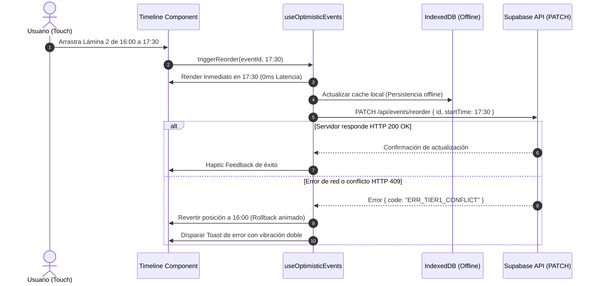

# FRONTEND_ARCHITECTURE.md — Arquitectura de Frontend, Vistas & Estado Táctil

> **Proyecto:** Ritmo — Calendario & Anotador Personal Inteligente  
> **Framework:** Next.js 14+ (App Router con Server Components y Client Components)  
> **Diseño:** Mobile-First táctil reactivo con Tailwind CSS  
> **Experiencia:** Inspirada en Google Calendar Mobile + Timeline Táctil Drag-and-Drop

---

## 1. Estructura de Directorios del Frontend

```
app/
├── layout.tsx                     # Root Layout con fuentes DM Sans y Manrope
├── page.tsx                       # Redirección inteligente a la vista activa
├── calendar/
│   ├── page.tsx                   # Vista principal: Grilla Mes + Agenda Vertical
│   └── loading.tsx                # Skeleton animado para carga instantánea
├── timeline/
│   └── page.tsx                   # Vista de Línea de Tiempo Táctil Drag-and-Drop
├── notes/
│   └── page.tsx                   # Anotador Híbrido (Notas del Día + Backlog)
└── settings/
    └── page.tsx                   # Ajustes, Modo Foco y Estado de Sincronización

components/
├── calendar/
│   ├── MonthGrid.tsx              # Grilla mensual interactiva con indicadores de color
│   ├── CollapsibleHeader.tsx      # Cabecera colapsable que se comprime al hacer scroll
│   ├── ScheduleAgendaFeed.tsx     # Feed vertical continuo de eventos estilo Google Calendar
│   └── MiniMonthStrip.tsx         # Tira horizontal de días (Lun a Dom) en estado colapsado
├── timeline/
│   ├── TactileTimelineView.tsx    # Contenedor principal con canvas de horas (07:00 a 23:00)
│   ├── DraggableTimeBlock.tsx     # Bloque individual con manejador táctil y respuesta háptica
│   ├── CollisionIndicator.tsx     # Zona roja translúcida sobre horarios protegidos de Tier 1
│   └── TimeSlotGrid.tsx           # Renglones horarios de 30/60 minutos
├── notes/
│   ├── NotesTabs.tsx              # Conmutador entre "Notas del Día" y "Backlog de Ideas"
│   ├── DailyContextualNotes.tsx   # Notas asociadas al bloque o fecha seleccionada
│   ├── IdeaBacklogStream.tsx      # Tarjetas de ideas categorizadas con etiquetas (#utn, etc.)
│   └── MarkdownNoteEditor.tsx     # Editor de texto enriquecido ultraliviano
├── ui/
│   ├── FloatingActionButton.tsx   # FAB accesible en esquina inferior derecha (+)
│   ├── BottomNavBar.tsx           # Barra de navegación móvil fija inferior (Mes, Timeline, Notas)
│   ├── ToastNotification.tsx      # Notificaciones flotantes tipo píldora
│   └── ModalSheet.tsx             # Modal tipo "Bottom Sheet" deslizable desde abajo
└── modals/
    ├── EventDetailModal.tsx       # Detalle de evento con opción de editar o borrar
    ├── QuickAddModal.tsx          # Formulario rápido para agendar bloques manuales
    ├── SearchModal.tsx            # Búsqueda instantánea en cliente con autocompletado
    └── RescheduleScenariosModal.tsx # Comparador visual de los 3 escenarios de reprogramación

hooks/
├── useCalendarNavigation.ts       # Control de fecha activa, mes cursor y drilldown
├── useTactileDragAndDrop.ts       # Lógica matemática de arrastre táctil y colisiones
├── useOptimisticEvents.ts         # Mutaciones optimistas con rollback automático
└── useHapticFeedback.ts           # Disparadores de vibración nativa del dispositivo

lib/
├── date-utils.ts                  # Envoltorios de date-fns forzando timezone GMT-3
├── color-tokens.ts                # Mapeo tipado de colores semánticos a clases Tailwind
└── client-cache.ts                # Almacenamiento local en IndexedDB/LocalStorage
```

---

## 2. Los Tres Modos de Visualización Principales

```
   ┌─────────────────────┐   ┌─────────────────────┐   ┌─────────────────────┐
   │    VISTA 1: AGENDA  │   │   VISTA 2: TIMELINE │   │    VISTA 3: NOTAS   │
   │  Google Calendar    │   │      TÁCTIL DND     │   │       HÍBRIDO       │
   │  (Mes + Feed Scroll)│   │  (Arrastre Digital) │   │  (Día vs Backlog)   │
   ├─────────────────────┤   ├─────────────────────┤   ├─────────────────────┤
   │ [Agosto 2026]       │   │ 08:00 [UTN Ingreso] │   │ [Día]   [Backlog]   │
   │ D L M M J V S       │   │ 09:00   (Tier 1)    │   │                     │
   │ · · · 1 2 3 4       │   │ 10:00               │   │ #utn                │
   │ ──(Scroll Feed)──── │   │ 11:00 [≡ Lámina 2]  │   │ • Ejercicios límit  │
   │ HOY · 27 AGO        │   │ 12:00   ↕ Arrastrar │   │ #dibujo             │
   │ 18:00 Lámina Dibujo │   │ 13:00               │   │ • Comprar hojas A3  │
   │ 20:00 Repaso UTN    │   │ 14:00 [Gimnasio]    │   │                     │
   └─────────────────────┘   └─────────────────────┘   └─────────────────────┘
```

### 2.1. Vista 1: Google Calendar Mobile Inspired (Mes + Agenda)
- **Cabecera Dinámica:** Al inicio de la pantalla, muestra el mes completo en una cuadrícula compacta de 7 columnas.
- **Transición por Scroll:** Al deslizar la lista vertical de eventos hacia arriba, la cuadrícula mensual colapsa mediante una animación suave de 240ms, transformándose en una barra semanal horizontal (`MiniMonthStrip`) que muestra únicamente los 7 días de la semana activa.
- **Drilldown Directo:** Tocar cualquier número en la grilla mensual navega inmediatamente al feed con el foco en esa fecha exacta.

### 2.2. Vista 2: Línea de Tiempo Táctil Drag-and-Drop (Timeline Táctil)
- **Resolución Horaria:** Muestra una escala temporal continua desde las 07:00 hasta las 23:00 con líneas guía cada 30 minutos.
- **Mecanismo de Arrastre Táctil (Touch Drag):**
  1. El usuario realiza una pulsación prolongada (*long press* de 250ms) sobre un bloque elástico (Tier 2 o Tier 3).
  2. El bloque se eleva ligeramente (`transform: scale(1.03)` con sombra suave) y el dispositivo emite una pulsación háptica corta de 15ms.
  3. Al deslizar el dedo hacia arriba o abajo, el bloque se desplaza en múltiplos de 15 minutos magnéticos (*grid snapping*).
  4. Si el dedo pasa sobre un bloque de Tier 1 (Devocional, Iglesia, UTN), el fondo de esa franja se ilumina en rojo suave y el bloque arrastrado no permite soltarse allí.
  5. Al levantar el dedo, el bloque encaja en la nueva posición con una animación suave y dispara una vibración de confirmación.

### 2.3. Vista 3: Anotador Híbrido (Notas & Backlog)
- **Segmented Control Superior:** Alterna entre:
  - *Notas del Día:* Filtra las anotaciones asociadas a la fecha activa en el calendario.
  - *Backlog de Ideas:* Lista continua de tarjetas tipo tarjeta Kanban clasificadas por etiquetas de color (`#utn`, `#dibujo`, `#devocional`, `#proyectos`, `#ideas`).

---

## 3. Gestión de Estado, Optimistic UI y Resiliencia Offline



---

## 4. Presupuesto de Rendimiento y Core Web Vitals Móviles

| Métrica | Objetivo Estricto | Estrategia de Cumplimiento |
| :--- | :---: | :--- |
| **LCP (Largest Contentful Paint)** | **< 1.1s** | Server Components para la carga inicial de eventos; renderizado directo en HTML sin esperar bundles de hidratación pesados. |
| **INP (Interaction to Next Paint)** | **< 60ms** | Gestos táctiles ejecutados mediante transformaciones CSS nativas (`transform: translateY(...)`) en el compositor de la GPU. |
| **CLS (Cumulative Layout Shift)** | **0.00** | Dimensiones explícitas de celdas horarias y celdas de calendario; cero saltos de contenido al cargar datos. |
| **Peso Total del Bundle JS** | **< 140 KB gzip** | Sin librerías pesadas tipo Moment.js o jQuery. Uso de funciones atómicas de `date-fns` y Tailwind compilado. |
