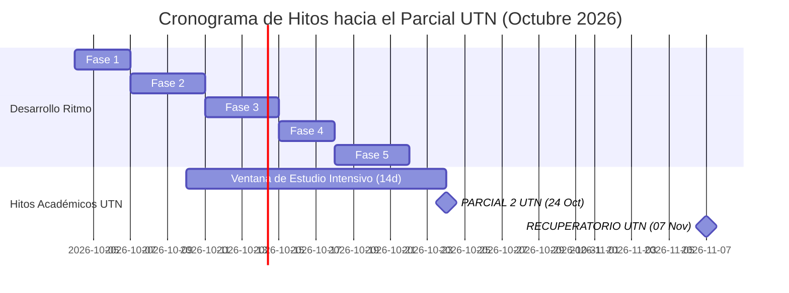

# PLAN_DE_PROYECTO_Y_GESTION.md — Plan de Proyecto, Cronograma & Hitos Críticos

> **Proyecto:** Ritmo — Calendario & Anotador Personal Inteligente  
> **Horizonte Temporal:** Octubre – Noviembre 2026  
> **Hito Máximo del Usuario:** Parcial 2 UTN (24 de Octubre) & Recuperatorio (7 de Noviembre)

---

## 1. Cronograma de Fases de Construcción (18 Días de Ejecución)

```
┌─────────────┬─────────────┬─────────────┬─────────────┬─────────────┐
│  FASE 1     │  FASE 2     │  FASE 3     │  FASE 4     │  FASE 5     │
│  Días 1–3   │  Días 4–7   │  Días 8–11  │  Días 12–14 │  Días 15–18 │
│  Fundación  │  UX Móvil & │  Telegram & │  Classroom  │  HITL Engine│
│  Supabase   │  Timeline   │  Gemini AI  │  & Drive    │  & QA Final │
└─────────────┴─────────────┴─────────────┴─────────────┴─────────────┘
```

### Fase 1: Fundaciones, Persistencia & Contratos (Días 1 a 3)
- Creación de proyecto en Supabase y ejecución del script DDL maestro.
- Definición de esquemas Zod en TypeScript y serializadores RFC 7807.
- Implementación de Next.js Middleware para protección de rutas con `RITMO_MASTER_TOKEN`.

### Fase 2: Experiencia Móvil de Calendario & Línea de Tiempo Táctil (Días 4 a 7)
- Construcción de la vista de calendario con grilla mensual y drilldown al día.
- Implementación de la cabecera colapsable animada al deslizar el feed vertical.
- Desarrollo del componente de **Línea de Tiempo Táctil** con gestos de arrastre por toque (`touch drag-and-drop`), zonas prohibidas de Tier 1 y mutaciones optimistas.

### Fase 3: Asistente Conversacional Telegram & Motor Multimodal Gemini (Días 8 a 11)
- Registro y webhook HTTPS del bot de Telegram en Vercel.
- Integración del SDK de Gemini 2.0 Flash con `responseSchema` de Zod.
- Procesamiento de mensajes de voz OGG/Opus y generación de tarjetas interactivas de confirmación (`InlineKeyboardMarkup`).
- OCR multimodal de fotografías de pizarrones escolares y apuntes.

### Fase 4: Integraciones Académicas (Google Classroom, Drive & NotebookLM) (Días 12 a 14)
- Conexión OAuth2 con Google Classroom y algoritmo de sincronización incremental (*delta sync*).
- Creación de la carpeta `/Ritmo_UTN_Notes/` en Google Drive y exportación continua de notas Markdown.
- Configuración de NotebookLM con la carpeta sincronizada como fuente de estudio.
- Algoritmo de cadencia de alertas (7d, 3d, 2d, 24h, 2h) con **Smart Quiet Windows**.

### Fase 5: Motor de Reprogramación Human-in-the-Loop & Pruebas en Vivo (Días 15 a 18)
- Algoritmo de detección de sobrecarga (>22:30 o colisión con Tier 1/2).
- Generador de los 3 escenarios de reajuste (A: Compresión diaria, B: Buffer de fin de semana, C: Prioridad UTN).
- Función transaccional RPC en Supabase para aplicación atómica del escenario elegido.
- Pruebas de carga, verificación de límites de cuota (15 RPM) y congelamiento de producción.

---

## 2. Ruta Crítica hacia los Exámenes de Ingreso de la UTN

El calendario de desarrollo está sincronizado para que el sistema esté 100% operativo antes de las fechas definitorias de ingreso universitario:

| Fecha Clave | Evento Crítico del Usuario | Rol Activo del Sistema Ritmo |
| :--- | :--- | :--- |
| **04 Octubre 2026** | Inicio de sprint final de desarrollo de Ritmo. | Puesta en marcha de las fundaciones de base de datos y UI. |
| **10 Octubre 2026** | Inicio de la ventana de 14 días previos al Parcial 2. | Ritmo activa automáticamente los bloques de estudio prioritario de 2 horas para UTN. |
| **12 Octubre 2026** | Sistema Ritmo completamente en producción. | Recepción activa de audios, alertas de láminas y Classroom funcionando. |
| **17 Octubre 2026** | Alerta D-7d previa al Parcial 2 de UTN. | Ritmo bloquea actividades elásticas y sugiere sesiones de repaso intensivo. |
| **21 Octubre 2026** | Alerta D-3d previa al Parcial 2 de UTN. | Ritmo verifica que todas las láminas de la semana estén entregadas para despejar la mente. |
| **24 Octubre 2026** | **PARCIAL 2 DE UTN (Hito Crítico)** | Bloque de Tier 1 inamovible (08:00 a 14:30). Smart Quiet Windows activo. |
| **31 Octubre 2026** | Alerta D-7d previa al Recuperatorio de UTN. | Preparación de refuerzo conceptual sobre dudas registradas en NotebookLM. |
| **07 Noviembre 2026**| **RECUPERATORIO DE UTN (Hito de Cierre)** | Cierre del ciclo de ingreso y consolidación de cursada aprobada. |

---

## 3. Matriz de Seguimiento y Criterios de Éxito de Hitos


