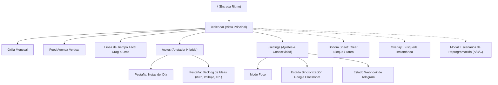

# 04_ARQUITECTURA_DE_INFORMACION_Y_NAVEGACION.md — Arquitectura de Información, Flujos & Navegación

> **Proyecto:** Ritmo — Calendario & Anotador Personal Inteligente  
> **Área:** Diseño de Interacción & Arquitectura de Información  
> **Estándar:** Flujo de Navegación Unificado Móvil/Desktop

---

## 1. Mapa de Navegación del Sistema (Sitemap)



---

## 2. Paradigma de Navegación por Dispositivo

### 2.1. Navegación en Dispositivos Móviles (Bottom Navigation Bar)
En pantallas móviles, la navegación reside en una **Barra Inferior Fija (Bottom Bar)** de `64px` de altura, ubicada sobre el borde inferior de la pantalla:

```
┌────────────────────────────────────────────────────────┐
│ [▦ Calendario]   [◷ Línea Táctil]   [✎ Notas]  [⚙ Ajustes]│
└────────────────────────────────────────────────────────┘
```
- **Calendario (Activo por defecto):** Muestra la combinación inspirada en Google Calendar Mobile (Mes colapsable + Feed de Agenda).
- **Línea Táctil:** Conmuta al canvas horario para reorganizar los bloques del día deslizando el dedo.
- **Notas:** Abre el anotador híbrido con acceso inmediato a los apuntes de la UTN.
- **Ajustes:** Configuración del modo foco, claves y estado de las integraciones.

### 2.2. Navegación en Monitores de Escritorio (Sidebar Lateral)
En pantallas superiores a `1024px`, la barra inferior se oculta y el sistema despliega el **Sidebar Lateral Izquierdo** de `248px` heredado del prototipo fundacional:
- Logotipo y Marca Ritmo.
- Selector de vistas (Mes, Semana, Día).
- Mini-calendario interactivo para saltar de fecha con indicador de fase del plan.
- Leyenda cromática explicativa de categorías.

---

## 3. Matriz de Modales, Drawers y Hojas Deslizables

| Identificador | Tipo de Contenedor | Desencadenador (Trigger) | Acción Principal |
| :--- | :--- | :--- | :--- |
| **`QuickAddSheet`** | Bottom Sheet móvil / Modal desktop | FAB flotante `(+)` o tecla `+` | Formulario rápido para crear bloque con título, hora, fecha y categoría. |
| **`EventDetailSheet`**| Bottom Sheet móvil / Modal desktop | Clic en píldora o bloque de evento | Ver detalles, enlace de Classroom, editar o eliminar bloque. |
| **`RescheduleSheet`** | Bottom Sheet interactiva | Alerta de sobrecarga o comando `/reprogramar` | Comparación visual de 3 escenarios (A, B, C) con botón de aplicación. |
| **`SearchOverlay`** | Overlay a pantalla completa | Botón de lupa `(⌕)` | Entrada de texto con filtrado en tiempo real de eventos y notas. |
| **`NoteEditorDrawer`**| Drawer lateral derecho | Botón *Nueva Nota* en `/notes` | Editor Markdown con selector de etiquetas (#utn, #dibujo, etc.). |

---

## 4. Transiciones de Estado y Ergonomía del Drilldown

```
[Grilla Mensual Completa]
         │
         │  (Tap sobre número de día, ej. "27")
         ▼
[Animación suave de compresión en 240ms]
         │
         ▼
[Cabecera reducida a tira semanal (L M M J V S D)]
         │
         ▼
[Feed Vertical enfocado en las actividades del día 27]
         │
         │  (Tap en botón "Línea Táctil")
         ▼
[Línea de Tiempo Táctil para mover bloques con el dedo]
```

Este flujo garantiza que el usuario navega de lo general a lo particular sin desorientarse, manteniendo siempre un punto de referencia claro de qué semana o día está gestionando.
